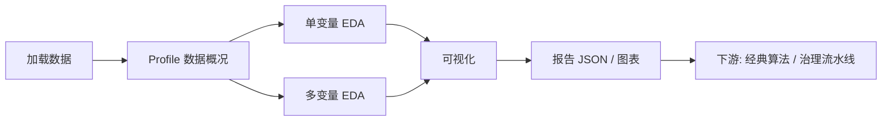

# EDA-Toolkit 使用流程与分析说明

本文档说明 **EDA-Toolkit（时空数据探索性分析工具）** 的推荐操作流程，以及每一步对应的分析含义、输出物与使用场景。适用于 Web 界面（`steda ui`）、命令行（`steda`）及 ETL 算子三种使用方式。

- 技术路线总览：[技术路线-时空数据分析挖掘.md](./技术路线-时空数据分析挖掘.md)
- Web 界面启动：[web_ui.md](./web_ui.md)
- ETL 算子契约：[etl_operators.md](./etl_operators.md)

---

## 1. 工具在做什么？

工具面向 **时空数据**：每条记录包含 **空间位置**（点/面/坐标）、**时间**（观测时刻等）及 **一个或多个数值指标**（如 PM2.5、温度、GDP）。

在正式建模（空间插值、空间回归、深度学习等）之前，通过 **探索性数据分析（EDA）** 回答：

- 数据是否可用？质量如何？
- 指标在时间、空间上呈现什么形态？
- 多个指标之间是否存在关联？
- 是否存在明显趋势、周期或异常？



**推荐顺序**：Profile → 单变量 → 多变量 → 可视化（或一键「完整 EDA」）。

---

## 2. 标准操作流程

### 2.1 步骤 0：准备与加载数据

| 项目 | 说明 |
|------|------|
| **支持格式** | GeoJSON、CSV（含经度/纬度）、Shapefile、GeoPackage、GeoParquet 等 |
| **时间列** | 如 `timestamp`、`date`；可自动识别或在界面/命令行中指定 |
| **内部表示** | `SpatioTemporalDataset`：统一封装 GeoDataFrame 与时间列语义 |

**本步分析内容**：不进行统计，仅完成读入、几何解析、时间列识别与数值字段列表，为后续步骤提供统一数据视图。

**Web 操作**：侧边栏选择「上传文件」或「内置样例」，填写时间列名后点击「加载数据」。

**命令行示例**：

```bash
# 后续命令均假设已指定时间列（如有）
steda profile -i 你的数据.geojson -o output/profile --time-column timestamp
```

---

### 2.2 步骤 1：数据预览

**对应模块**：Web 标签「数据预览」  
**对应代码**：`SpatioTemporalDataset` + 地图/表格展示

| 展示内容 | 分析含义 |
|----------|----------|
| 行数、字段数、几何类型 | 数据规模；点数据或面数据 |
| 地图散点 | 空间覆盖是否合理、是否存在明显离群位置 |
| 属性表 | 原始字段与取值形态 |

**目的**：人工完成第一轮 **空间合理性检查**，再进入自动统计。

---

### 2.3 步骤 2：概况 Profile（数据质量）

**对应模块**：Web「概况 Profile」/ CLI `steda profile` / ETL 算子 `profile`  
**对应代码**：`eda_toolkit.eda.profile.build_profile()`  
**主要输出**：`profile.json`

| 输出项 | 在分析什么 | 实际用途 |
|--------|------------|----------|
| CRS、空间范围 bounds | 坐标系与地理范围 | 检查投影、范围是否正确 |
| 时间范围、时间步数量 | 起止时间与唯一时刻数 | 确认时间维是否完整 |
| 各列缺失率、唯一值数 | 空值比例与离散程度 | 决定清洗、插补策略 |
| 无效几何数量 | 坏几何、自交等 | GIS 数据质量 |
| 重复时空键 | 同一时刻同一位置是否重复 | 面板/站点去重依据 |
| 数值字段 describe | 均值、标准差、分位数等 | 全局数量级与离群粗判 |

**一句话概括**：Profile 回答 **「这批数据能不能用、缺什么、规模多大」**，可作为数据治理与下游算法的 **元数据说明书**。

---

### 2.4 步骤 3：单变量 EDA

**对应模块**：Web「单变量」/ 完整 EDA 中的 `univariate`  
**对应代码**：`eda_toolkit.eda.univariate.analyze_univariate()`  
**主要输出**：`univariate.json`（或界面 JSON 展示）

对每一个 **数值字段**（如 `pm25`、`temp`）从三个角度分析：

#### （1）空间维度 `spatial`

| 指标 | 含义 |
|------|------|
| mean / std / min / max | 全体记录上该指标的总体水平与离散度 |
| 分位数（25%、50%、75%、95%） | 分布形态、极端值 |

**在分析什么**：暂不考虑时间，看该变量在 **所有时空样本混合** 下的分布（全局描述统计）。

#### （2）时间维度 `temporal`（需要时间列）

| 指标 | 含义 |
|------|------|
| 按时间聚合的 mean / std / count | 每个时刻的空间平均 → 构成 **时间序列** |
| global_mean_over_time 等 | 时间曲线整体水平与波动 |
| ADF 检验（样本 ≥ 20 时） | 序列是否近似平稳（p < 0.05 提示可能平稳） |
| seasonal_strength（序列足够长时） | 季节性强度（STL 粗分解） |

**在分析什么**：将空间 **聚合为一条时间线**（如「多站点每日平均 PM2.5」），观察 **趋势、周期、平稳性**，为时间建模提供依据。

#### （3）时空联合 `spatiotemporal`

| 指标 | 含义 |
|------|------|
| 各时刻空间均值的均值、方差 | 空间平均水平随时间变化幅度 |
| 各时刻空间方差的平均 | 同一时刻各地差异程度 |

**在分析什么**：同时刻画 **时间演化** 与 **空间内差异**：时间方差大表示整体涨落明显；空间方差大表示各地不同步、可能存在热点。

---

### 2.5 步骤 4：多变量 EDA

**对应模块**：Web「多变量」/ 完整 EDA 中的 `multivariate`  
**对应代码**：`eda_toolkit.eda.multivariate.analyze_multivariate()`  
**主要输出**：`multivariate.json`  
**前提**：至少 **2 个数值字段**

| 输出 | 在分析什么 | 实际用途 |
|------|------------|----------|
| Pearson 相关矩阵 | 线性相关（-1～1） | 是否同升同降 |
| Spearman 相关矩阵 | 单调相关 | 对非线性关系更稳健 |
| pearson_by_time | 按每个时间切片单独计算相关 | 关系是否随季节/时期变化 |
| PCA 主成分 | 将多指标压缩为少数综合因子 | 降维预览、特征综合 |
| explained_variance_ratio | 各主成分解释的信息比例 | 判断保留几个主成分有意义 |

**一句话概括**：回答 **「指标之间是否相关、能否用少数综合变量代表多指标」**，为特征选择与回归建模提供依据。

---

### 2.6 步骤 5：可视化

**对应模块**：Web「完整 EDA」中勾选「生成图表」/ `run_eda` 的 `plots`  
**对应代码**：`eda_toolkit.viz.plots`

#### 单变量图表（每个数值字段，输出在 `univariate/`）

| 图表文件 | 表达内容 |
|----------|----------|
| `*_distribution.png` | 直方图 + 核密度：整体分布形态 |
| `*_boxplot.png` | 箱线图（按时间分组）：各时刻离散度与离群 |
| `*_spatial.png` | 空间分布：点分级设色或面 choropleth |
| `*_timeseries.png` | 时间序列：空间均值曲线 + min–max 带 |
| `*_temporal_band.png` | 时间聚合：均值 ± 标准差与 min–max 带 |

#### 多变量图表（输出在 `multivariate/`）

| 图表文件 | 表达内容 |
|----------|----------|
| `corr_pearson.png` | Pearson 相关热力图 |
| `corr_spearman.png` | Spearman 相关热力图 |
| `pairwise_scatter.png` | 两两散点矩阵（最多 4 个字段） |
| `pca_scree.png` | PCA 碎石图 / 累计方差贡献 |
| `pca_loadings.png` | 各变量在主成分上的载荷条形图 |

#### 综合

| 图表 | 生成条件 |
|------|----------|
| `timeseries.png` / `choropleth.png` | 与早期版本兼容的综合图 |

配置项 `plot_options.univariate_plots` / `multivariate_plots` 可分别开关（见 `eda_default.json`）。

**目的**：将统计结果转化为 **直观图表**，用于汇报、材料与技术交付。Web 界面在单变量/多变量标签页中可直接预览上述图表。

---

### 2.7 步骤 6：完整 EDA（一键流水线）

**对应模块**：Web「完整 EDA」/ CLI `steda run` / ETL 算子 `eda_run`  
**对应代码**：`eda_toolkit.eda.runner.run_eda()`  
**配置文件示例**：`examples/config/eda_default.json`

执行顺序（可按配置开关）：

```text
Profile → 单变量 → 多变量 → 绘图 → manifest.json
```

| 配置项 | 作用 |
|--------|------|
| `profile` | 是否执行步骤 2 |
| `univariate` | 是否执行步骤 3 |
| `multivariate` | 是否执行步骤 4 |
| `plots` | 是否执行步骤 5 |
| `pca_components` | PCA 主成分个数 |

**典型输出目录**：

| 文件 | 内容 |
|------|------|
| profile.json | 数据概况 |
| univariate.json | 单变量结果 |
| multivariate.json | 多变量结果 |
| timeseries.png | 时间序列图 |
| manifest.json | 本次运行项摘要 |

**命令行示例**：

```bash
steda run -i examples/data/sample_points.geojson \
  -c examples/config/eda_default.json \
  -o output/eda \
  --time-column timestamp
```

---

### 2.8 步骤 7：ETL 算子（数据治理集成）

**对应模块**：Web「ETL 算子」/ `steda operators`  
**说明文档**：[etl_operators.md](./etl_operators.md)

| 算子名 | 等价操作 | 流水线用途 |
|--------|----------|------------|
| `profile` | 仅 Profile | 入库后质检节点 |
| `eda_run` | 完整 EDA | 单节点完成探索分析并落盘 |

每个算子输出 `operator_result.json`，记录 `artifacts` 路径，便于平台审计、重跑与展示。

```bash
steda operators list
steda operators execute profile -i 数据.geojson -o output/op --time-column timestamp
```

---

## 3. Web 界面标签与流程对照

| 标签页 | 对应步骤 | 建议使用时机 |
|--------|----------|--------------|
| 数据预览 | 0～1 | 加载后先看地图与表 |
| 概况 Profile | 2 | 确认质量、缺失、时间范围 |
| 单变量 | 3 | 深入分析某一指标 |
| 多变量 | 4 | 两指标及以上，看相关与 PCA |
| 完整 EDA | 5～6 | 需要打包 JSON/图表 |
| ETL 算子 | 7 | 了解或试跑治理平台算子 |

侧边栏「EDA 选项」勾选与 `eda_default.json` 中 `profile` / `univariate` / `multivariate` / `plots` 一致。

---

## 4. 三种使用方式对照

| 方式 | 启动 | 适用场景 |
|------|------|----------|
| **Web 界面** | `steda ui` | 交互探索、演示、非技术人员 |
| **命令行** | `steda profile` / `steda run` | 脚本批处理、服务器 |
| **Python API** | `load_dataset` + `run_eda` | 嵌入自有系统、Notebook |
| **ETL 算子** | `steda operators execute` | 数据治理 DAG 节点 |

Python API 示例：

```python
from eda_toolkit.io.loaders import load_dataset
from eda_toolkit.eda.runner import run_eda

ds = load_dataset("data/points.geojson", time_column="timestamp")
result = run_eda(ds, config={"profile": True, "plots": True}, output_dir="output/run")
```

---

## 5. 内置样例数据说明

路径：`examples/data/sample_points.geojson`

- 9 条记录：3 个时刻 × 3 个空间位置（北京附近点）
- 字段：`timestamp`、`pm25`、`temp`

走完完整 EDA 后，可对照理解：

- Profile：行数、时间步、缺失情况  
- 单变量：pm25 随时间是否升高、空间差异  
- 多变量：pm25 与 temp 是否相关  
- 时间图：月均变化折线  

样例用于 **熟悉流程**，分析结论需以真实业务数据为准。

---

## 6. 常见问题：该看哪一块？

| 关心的问题 | 优先查看 |
|------------|----------|
| 数据有没有缺、坐标对不对？ | Profile |
| 指标随时间升还是降？ | 单变量 temporal + 时间图 |
| 各地差异大不大？ | 单变量 spatiotemporal |
| 两个指标是否一起变化？ | 多变量 Pearson / Spearman |
| 多个指标能否合成少数因子？ | 多变量 PCA |
| 要写报告、导出材料？ | 完整 EDA |

---

## 7. 与阶段 1.2（规划中）的关系

当前 **v0.1** 对应技术路线 **阶段 1.1（时空 EDA）**。后续 **阶段 1.2** 将补充：

| 模块 | 将分析什么 | 与当前 EDA 的关系 |
|------|------------|------------------|
| 点模式分析 | 点是否聚集/随机（K 函数、KDE） | Profile 通过后做点过程 |
| 面数据 Moran / LISA | 空间自相关、热点冷点 | 多变量后的空间结构诊断 |
| 空间插值 | 未观测位置推测（IDW、克里金） | 结合单变量空间分布与变异函数 |

上述能力将在 `algorithms/` 中逐步实现，并注册为 ETL 算子。

---

## 8. 版本与依赖说明

- 当前版本：**v0.1.0**
- 建议 Python：**3.10～3.12**（3.14 部分地理库可能存在兼容警告）
- 安装：`pip install -e ".[ui]"`（含 Web 界面）

---

*文档版本：v1.0 | 与 EDA-Toolkit v0.1 代码一致*
