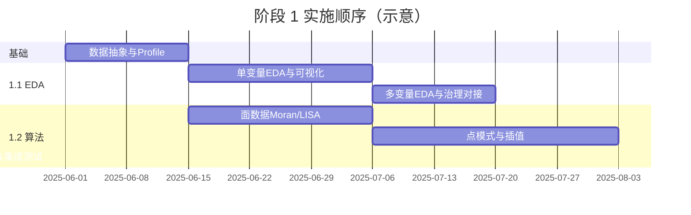

# 时空数据分析挖掘 — 技术路线

## 1. 模块定位与目标

本模块面向**时空数据**（带空间位置与时间维度的观测或栅格数据），提供从探索性分析、经典空间统计到（后续）深度学习挖掘的完整能力链。

| 阶段 | 时间里程碑 | 核心目标 |
|------|------------|----------|
| 阶段 1 | 7 月 10 日：时空 EDA 工具集；8 月 20 日：经典算法 | 可独立使用、可接入数据治理/ETL 流程的分析与算法能力 |
| 阶段 2 | 11 月 30 日：预测与基础模型；12 月 20 日：两类场景技术演示 | 基于论文与既有基础的深度学习技术验证与 Demo |

**阶段 1 为本期实现范围**；阶段 2 在路线中仅做架构预留与方向说明，不展开实现细节。

---

## 2. 总体架构

建议采用**分层 + 插件化**结构，便于「独立工具」与「ETL 嵌入」两种交付形态共用同一套核心逻辑。

```
┌─────────────────────────────────────────────────────────────┐
│  交付层：CLI / REST API / Notebook 示例 / ETL 算子注册      │
├─────────────────────────────────────────────────────────────┤
│  编排层：任务定义、参数校验、结果元数据、与治理平台对接       │
├─────────────────────────────────────────────────────────────┤
│  能力层                                                      │
│  ├─ 1.1 时空 EDA（统计 + 可视化）                            │
│  └─ 1.2 经典时空算法（点模式 / 面数据 / 插值）               │
├─────────────────────────────────────────────────────────────┤
│  数据层：时空数据抽象、CRS/时间索引、读写适配（GeoParquet等）│
└─────────────────────────────────────────────────────────────┘
                              │
                    阶段 2 预留：模型服务层（推理 / 微调接口）
```

**设计原则**

- **数据抽象统一**：点（Point）、线面（Line/Polygon）、规则/不规则栅格（Raster）、带时间序列的 GeoDataFrame，统一为内部 `SpatioTemporalDataset` 接口，避免各算法各自解析格式。
- **无状态算子**：ETL 侧每个步骤输入 DataFrame/路径 + 配置 JSON，输出结果路径 + 统计报告，便于重跑与审计。
- **可视化与计算分离**：统计量由计算模块产出，绘图模块只消费结构化结果，便于 API 返回表格而不强制出图。

---

## 3. 阶段 1 — 详细技术路线

### 3.1 任务 1.1：时空探索性数据分析（EDA）与可视化增强

**目标（对应交付）**：形成支持**单机/脚本独立使用**，并能**注册到数据治理工作流**的时空 EDA 工具集；覆盖单变量与多变量分析。

#### 3.1.1 数据接入与预处理

| 环节 | 做法 |
|------|------|
| 支持格式 | GeoJSON/Shapefile、GeoParquet、CSV（含 lon/lat/time 列）、NetCDF/Zarr（栅格+时间维） |
| 技术选型 | `geopandas` + `shapely`（矢量）；`xarray` + `rioxarray`（栅格）；`pyproj` 做 CRS 转换 |
| 时间处理 | 统一为 `DatetimeIndex` 或离散时间步 `t0..tn`；支持不规则采样聚合（按日/周/月重采样） |
| 质量检查 | 缺失率、重复时空键、几何有效性、CRS 是否定义、时间范围与空间范围摘要 |

**输出**：`profile.json`（维度、CRS、时间范围、字段类型、缺失统计）供下游 EDA 与治理平台展示。

#### 3.1.2 单变量时空 EDA

| 分析类型 | 内容 | 实现要点 |
|----------|------|----------|
| 时间维度 | 趋势、季节性（STL/分解）、自相关（ACF/PACF）、变点粗检 | `statsmodels`、`pandas` 时间序列；按空间单元聚合后再做时间分析 |
| 空间维度 | 分布直方图、空间分位数、全局/局部极端值 | 对属性做 `describe`；空间上可做分块统计 |
| 时空联合 | 时空立方体摘要（按时间切片的空间均值/方差；按区域聚合的时间曲线） | 先 `groupby(time)` 再空间统计，或 `groupby(region_id)` 再时间统计 |
| 平稳性与结构 | 空间平稳性粗判（分段均值方差）；时间平稳性（ADF 等，样本足够时） | 作为「提示」而非严格检验，避免小样本误报 |

#### 3.1.3 多变量时空 EDA

| 分析类型 | 内容 | 实现要点 |
|----------|------|----------|
| 相关 | Pearson/Spearman；分时间窗、分空间区的相关矩阵 | `pandas.corr` + 分组 |
| 时空交叉 | 两变量在同时空位置的散点、滞后相关（时间滞后、空间滞后粗算） | 空间滞后可用简单邻接权重矩阵（见 3.2 面数据基础） |
| 降维预览 | PCA（多指标面数据或栅格展平后）；结果用空间着色图展示 | `sklearn.decomposition.PCA`，主成分载荷表输出 |
| 聚类探索 | 时空特征向量（如各时间步均值）上的 K-Means / 层次聚类，地图展示分区 | 用于发现同质区域，非最终分类产品 |

#### 3.1.4 可视化方法 enrich

在基础统计表之外，提供**可配置、可导出**的图表（PNG/SVG/HTML）：

| 图表 | 适用数据 | 库 |
|------|----------|-----|
| 时间序列图（单/多序列、分面） | 面板、站点 | `matplotlib` / `plotly` |
| 空间分布 choropleth / 点分级设色 | 矢量面/点 | `geopandas.plot`、`mapclassify` 分级 |
| 时空动画 / 小 multiples | 多时相面或栅格 | `matplotlib.animation` 或 `plotly` frames |
| 变异函数图、时空热力图 | 连续面、栅格 | 为 3.2 插值与面分析做 EDA 铺垫 |
| 交互地图（可选） | 演示与 Notebook | `folium` / `pydeck` |

**API 形态**：`eda.run(dataset, config) -> { tables, figures, profile }`，`config` 声明启用哪些分析项，便于 ETL 只跑必要步骤。

#### 3.1.5 与数据治理集成（1.1 交付）

- 定义**标准算子契约**：输入路径、CRS、时间列名、字段列表、输出目录。
- 提供 **Python 包入口** + **命令行**（如 `steda profile --input ...`）。
- 若治理平台为 DAG 调度：将每个 EDA 子步骤注册为独立算子（Profile / Univariate / Multivariate / Plot），支持失败重试与日志挂载。
- 元数据回写：将 `profile.json` 与关键图表路径写入治理平台的任务结果表。

**阶段 1.1 建议里程碑（7 月 10 日）**

1. 数据抽象 + Profile  
2. 单变量时间/空间/时空摘要  
3. 多变量相关与 PCA  
4. 核心可视化 + CLI/算子注册  
5. 1～2 个端到端样例数据集（如站点 PM2.5、区县 GDP 面板）

---

### 3.2 任务 1.2：经典时空数据分析算法与 ETL 集成

**目标（对应交付）**：实现**空间点模式分析**、**面数据（Areal）模式分析**、**空间插值**等经典方法，并作为 **ETL 可编排算子** 接入流水线。

#### 3.2.1 空间点模式分析（Point Pattern Analysis）

| 能力 | 算法/指标 | 技术选型 |
|------|-----------|----------|
| 一阶 | 核密度估计（KDE）、强度热力图 | `scipy.stats.gaussian_kde` 或 `sklearn.neighbors.KernelDensity`；网格化输出 GeoTIFF/矢量等值面 |
| 二阶 | K 函数、L 函数、配对相关 G 函数 | **PySAL**（`pointpats`）：`Kest`、`Lest`、`Gest` |
| 点类型 | 完全空间随机 CSR 检验、蒙特卡洛包络 | `pointpats.csra`、`pointpats.poisson` 等模拟包络 |
| 时空扩展（可选 v1） | 按时间切片分别做 K 函数，或时空 K（实现复杂可放 v1.1） | 先**时间分层**再调用静态点分析，降低首期复杂度 |

**输入**：点 GeoDataFrame（坐标 + 可选属性 + 时间列）。  
**输出**：函数曲线 CSV、显著性结论、密度栅格/矢量。

#### 3.2.2 面数据（Areal）模式分析

| 能力 | 算法/指标 | 技术选型 |
|------|-----------|----------|
| 空间自相关 | Moran's I、Geary's C、局部 LISA（Gi* / Moran Local） | **PySAL** `esda`：`Moran`、`Geary`、`Moran_Local` |
| 空间权重 | Queen/Rook 邻接、KNN、距离带宽 | `libpysal.weights`：`Queen`、`KNN`、`DistanceBand` |
| 时空面板（基础） | 分时期 Moran's I 对比；时空滞后项探索 | 对每个 `t` 构建截面权重矩阵；结果汇总为时序表 |
| 回归探索（可选） | 空间滞后模型 SLM / 空间误差 SEM 入门 | `spreg`（PySAL）；ETL 中作为「分析算子」而非训练平台 |

**输入**：面 GeoDataFrame + 数值字段 +（可选）时间标识。  
**输出**：全局/局部指标表、LISA 聚类图（HH/LL/LH/HL）、权重矩阵诊断信息。

#### 3.2.3 空间插值

| 方法 | 场景 | 技术选型 |
|------|------|----------|
| 确定性 | IDW、径向基函数 RBF | `scipy.interpolate`；或 `pykrige`（若需地统计一致性） |
| 地统计 | 普通克里金（OK）、泛克里金（UK） | **PyKrige** / **gstools**（变异函数拟合更灵活） |
| 输出 | 规则网格 GeoTIFF、等值线矢量 | `rasterio` 写栅格；`matplotlib.contour` 转等值面（可选） |

**流程**：EDA 变异函数图 → 拟合理论模型（球形/指数等）→ 克里金插值 → 交叉验证（留一或 K 折）报告 RMSE。

**注意**：插值算子需强制指定 **CRS** 与 **空间范围/分辨率**，避免 ETL 无参运行产生错误网格。

#### 3.2.4 ETL 集成方式（1.2 交付）

与 1.1 共用编排层，每个算法实现为：

```text
算法算子: 输入(GeoDataFrame路径, params) → 输出(结果表/栅格路径, 诊断JSON, 可选图)
```

| 集成点 | 说明 |
|--------|------|
| 参数模式 | JSON Schema 校验（带宽、核类型、变异函数模型、权重类型等） |
| 依赖顺序 | Profile →（可选）EDA → 点/面分析或插值；插值前可有变异函数 EDA 步骤 |
| 资源 | 大面域栅格插值考虑分块；点过程蒙特卡洛可配置模拟次数 |
| 可测试性 | 固定随机种子；PySAL/sklearn 等版本锁定在 `requirements.txt` |

**阶段 1.2 建议里程碑（8 月 20 日）**

1. 空间权重与 Moran/LISA 算子  
2. 点过程 K/L/G + KDE 算子  
3. 变异函数 + 克里金 + IDW 算子  
4. ETL 注册文档与 2 条流水线样例（点事件 + 区县指标面）  
5. 单元测试 + 与小样本金标准对比（文献或 R/`spdep` 对照可选）

---

## 4. 阶段 1 技术栈汇总

| 层次 | 推荐组件 |
|------|----------|
| 语言 | Python 3.10+ |
| 矢量时空 | GeoPandas, Shapely, PyProj |
| 栅格时空 | Xarray, Rioxarray, Rasterio |
| 空间统计 | PySAL（libpysal, esda, pointpats, spreg） |
| 插值/地统计 | PyKrige 或 GSTools |
| 通用数值 | NumPy, SciPy, Pandas, Scikit-learn |
| 可视化 | Matplotlib, Plotly（交互）, Mapclassify |
| 接口 | Typer/Click（CLI）, FastAPI（若需 REST） |
| 打包 | `pyproject.toml` 可安装包；可选 Docker 镜像供治理平台调度 |

**资源需求（与规划一致）**：阶段 1 以 CPU 为主；大栅格与蒙特卡洛可配置并行（`joblib` / `dask`）。GPU 主要在阶段 2 使用。

---

## 5. 阶段 2 — 技术方向概览（本期不实现）

阶段 2 在阶段 1 的**统一数据抽象**与**算子契约**之上扩展，避免重复建设。

### 5.1 时空基础模型（跨场景理解）

| 方向 | 做法概要 |
|------|----------|
| 目标 | 多源、多区域时空数据的表征与下游任务（分类、异常、检索）的统一嵌入 |
| 技术路线 | 调研 EarthPT、SatMAE、时空 Transformer、图时空网络等；选定 1～2 篇可复现论文做 **Fine-tune / 线性探测** 验证 |
| 工程 | 模型权重托管、GPU 推理服务、与阶段 1 的 `SpatioTemporalDataset` 对齐的张量构造 pipeline |
| 数据 | 需外采或开源卫星/气象/交通等数据（对应规划中的数据采购） |

### 5.2 未观测区域时空预测

| 方向 | 做法概要 |
|------|----------|
| 问题 | 空间上缺测、时间上外推、或新区域零样本 |
| 方法谱系 | 图神经网络（空间邻接图）、ConvLSTM/PredRNN、时空 Kriging 与深度学习混合、扩散模型补全等 |
| 验证 | 人为遮罩评估（MAE/RMSE/CrPS）；与阶段 1 克里金、IDW 基线对比 |
| 交付 | 11 月 30 日前完成模型训练/推理管线；12 月 20 日**两类数据**（如栅格预测 + 点/面填图）技术 Demo |

### 5.3 与阶段 1 的衔接

- EDA 输出用于特征工程与遮罩策略设计。  
- 经典 Moran/LISA 可作为模型残差的空间诊断。  
- ETL 中预留「深度学习推理」算子类型，参数结构与阶段 1 算子一致。

---

## 6. 质量、风险与依赖

| 项 | 说明 |
|----|------|
| 数据依赖 | 阶段 1 可用开源样例（NYC 出租车点、国内公开区县面、气象站点）；生产需治理平台提供标准入库格式 |
| CRS 一致性 | 所有空间算法前统一投影到米制 CRS（做距离与带宽），对外展示可转 WGS84 |
| 性能 | 大 N 点 KDE / 高分辨率克里金需分块与缓存；ETL 超时配置需可调 |
| 许可 | PySAL、GeoPandas 等为 BSD/MIT 系，注意 GDAL/投影库系统依赖 |
| 范围控制 | 阶段 1 不做深度学习训练；时空 K 函数等高级点过程可列 v1.1 backlog |

---

## 7. 建议实施顺序（阶段 1）



1. **第 1～2 周**：`SpatioTemporalDataset`、读写、Profile、CLI 骨架。  
2. **第 3～5 周**：单变量/多变量 EDA + 核心图；对接治理平台算子注册（7/10 节点）。  
3. **第 4～7 周**：PySAL 面分析 + 点过程 + PyKrige 插值（与 EDA 并行）。  
4. **第 8 周**：ETL 样例流水线、文档、测试与性能调优（8/20 节点）。

---

## 8. 交付物清单（阶段 1）

| 编号 | 交付物 |
|------|--------|
| D1 | 可安装 Python 包（或 monorepo 子模块）及 `requirements.txt` / Docker |
| D2 | 时空 EDA 工具集：Profile、单变量、多变量、可视化配置 |
| D3 | 经典算法库：点模式、面 LISA/Moran、IDW/克里金 |
| D4 | ETL 算子说明：参数 Schema、输入输出、示例 DAG |
| D5 | 样例数据与 Notebook / 端到端脚本 |
| D6 | 测试用例与基准报告（可选与 R 对照） |

---

## 9. 文档与代码仓库建议结构

```text
探索性数据分析/
├── docs/
│   └── 技术路线-时空数据分析挖掘.md   # 本文档
├── src/
│   └── st_analysis/                  # 包名示例
│       ├── io/                       # 读写与 SpatioTemporalDataset
│       ├── eda/                      # profile, univariate, multivariate
│       ├── viz/                      # 绘图
│       ├── algorithms/
│       │   ├── point_pattern/
│       │   ├── areal/
│       │   └── interpolation/
│       └── etl/                      # 算子注册与 schema
├── tests/
├── examples/
│   └── notebooks/
├── pyproject.toml
└── README.md
```

---

*文档版本：v1.0 | 范围：全模块路线，实现重点为阶段 1 | 可根据实际治理平台接口（Airflow/DolphinScheduler/自研）在 ETL 章节补充具体适配说明。*
